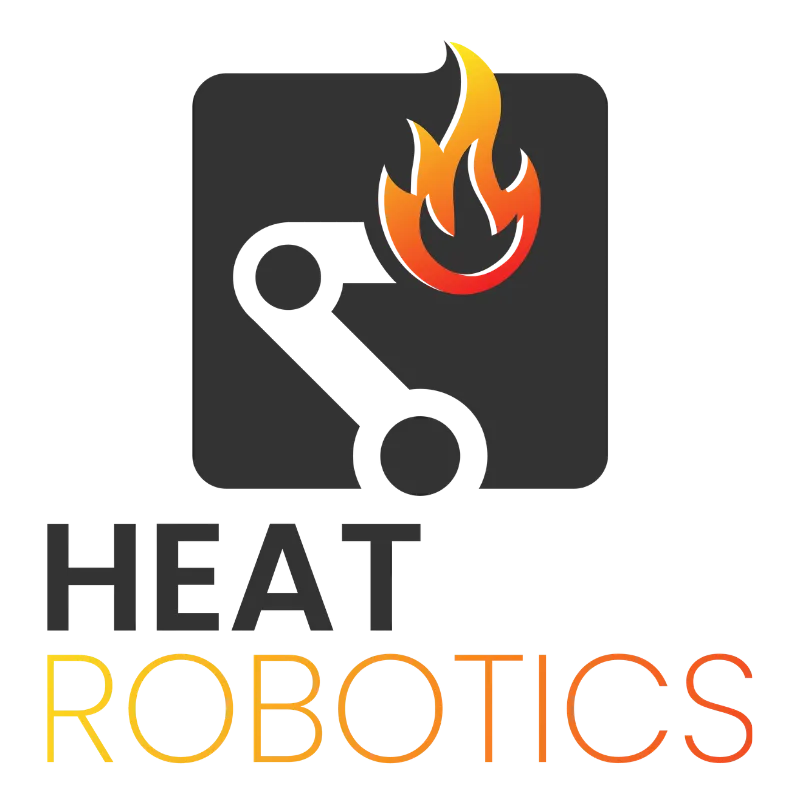

<p align="center">
  <a href="https://github.com/HEATRobotics">
    
  </a>
</p>

# EMBR AutoBot

This repository is dedicated to the development of EMBR and it's autonomy. Our goals this year is to get
EMBR up and running through remote control, and eventually reach a basic level of autonomy. We plan to achieve 
this through simulations and real world testing. By the end of the year we expect to be able to not only remote control
EMBR, but for EMBR to be able to navigate a simple space, find hotspots, and log them, on its own. 

# Welcome

Welcome to EMBR, HEAT Robotics’ robot software workspace. Whether you are joining
the team, returning for another term, or exploring the project, this guide will
help you understand what we are building and make your first contribution.

[About](#about) · [EMBR Goals](#embr-goals) · [Getting Started](#getting-started) · [Contributing](#contributing) · [Documentation Standards](#documentation-standards) · [Maintainers](#maintainers)

## Maintainers

Maintained by the [HEAT Robotics team](https://github.com/HEATRobotics).
For repository access, project direction, and a first task, connect with the team.
For reproducible bugs or documentation questions, open a
[GitHub issue](https://github.com/HEATRobotics/EMBR-AutoBot/issues).

## About

HEAT Robotics is a student engineering team at UBC Okanagan developing robotics
for wildfire detection and response. EMBR stands for **Ember Mitigation Bot
Responder** and supports the team’s work on finding residual hotspots after a
wildfire. Learn more in [UBC’s introduction to EMBR](https://engineering.ok.ubc.ca/2024/05/29/soe-feature-learn-more-about-the-heat-robotics-team-and-their-award-winning-embr-project/).

This repository brings together robot descriptions and control software built
around **ROS 2 Humble** and **RViz** in a single workspace at
`embr_phys/ros2_ws`. RViz demonstrations use mock hardware; Gazebo integration
remains a development goal.

**Website:** [HEAT Robotics’ UBC team profile](https://experience.apsc.ubc.ca/okanagan/student-groups/design-teams-clubs-and-associations).

**Follow the team:** [GitHub](https://github.com/HEATRobotics) ·
[LinkedIn](https://www.linkedin.com/company/heat-robotics/) ·
[Instagram](https://www.instagram.com/heat.robotics?stkn=d2o2YjZ2cnAwc3Zp)

## EMBR Goals

Our work is organized around four main targets. Progress is measured by
working capabilities and demonstrated results.


<details>
<summary>Manually update goal progress</summary>

Edit the four booleans in
[`scripts/documentation/progress.json`](scripts/documentation/progress.json):
set a goal to `true` when complete, or `false` when not complete. Each goal
controls its own segment and contributes 25% of overall progress.

From the repository root, regenerate the bar:

```bash
python3 scripts/documentation/update_progress.py
```

Commit the configuration, generated SVG, and updated README link on your branch
and submit a pull request to protected `main`. No GitHub Action updates the bar.

</details>

### 1. Teleoperation

Enable an operator to reliably drive and control EMBR through ROS 2.

- Connect operator commands to the robot's drivetrain and capstan interfaces.
- Demonstrate controlled driving, steering, and stopping on the physical robot.
- Provide feedback on robot motion and state. (TBD)

### 2. Simulation

Build a repeatable simulation environment for testing robot behavior before
integrating changes with hardware.

- Run the robot in Gazebo with working motion, motor, and terrain physics.
- Use consistent ROS 2 control interfaces across simulation and hardware.
- Demonstrate teleoperation and sensor feedback in a documented simulation setup.

### 3. Real World

Bring the simulated workflows onto the physical robot and validate operation
in real environments.

- Integrate and verify drivetrain, sensors, and communication on hardware.
- Test driving, sensor feedback, and operator control on representative terrain.
- Document field results and resolve issues found during physical testing.

### 4. Autonomy

Enable EMBR to navigate and support residual hotspot detection with reduced
operator input.

- Integrate sensor data for localization, mapping, and obstacle detection.
- Develop and validate navigation and hotspot detection behaviors in simulation.
- Demonstrate autonomous tasks on hardware with an operator able to take control.

**Current starting point:** the simple robot can be driven in RViz with mock
hardware and command-based odometry. Physical CANopen control lives in
`embr_drivetrain`; full motor and terrain physics remain development work.

## Getting Started

You do not need to know every part of the stack to contribute. Start with a
working visualization, then choose a small task with a maintainer.

1. **Connect with the team.** Confirm repository access and the area you will
   work on: robot descriptions, controls, simulation, or documentation.
2. **Get the source.** Clone the repository and enter its root directory:

   ```bash
   git clone https://github.com/HEATRobotics/EMBR-AutoBot.git
   cd EMBR-AutoBot
   ```

3. **Choose an environment.** Use native Ubuntu 22.04 with ROS 2 Humble, or
   the Docker Desktop environment for Windows and macOS described below.
4. **Reach a first milestone.** Follow the
   [keyboard movement walkthrough](embr_phys/README.md#keyboard-movement-in-rviz-ros-2-humble)
   to view and drive the simple robot in RViz.

### Development environment

On Ubuntu 22.04, install ROS 2 Humble and follow the
[native Ubuntu workflow](documentation/workflow.md#native-ubuntu-development).
From the repository root, install project dependencies and build:

```bash
bash scripts/environment/setup_native_ubuntu.sh
source /opt/ros/humble/setup.bash
cd embr_phys/ros2_ws
colcon build --symlink-install
source install/setup.bash
ros2 launch embr_description view_embr_simple.launch.py
```

Windows and macOS users should follow [Docker development](documentation/docker/development.md)
for Docker Desktop and X11 setup. Use `compose.windows.yaml` on Windows or
`compose.macos.yaml` on macOS; both provide the `development` service.
The Docker guide describes the limitations of RViz through XQuartz on macOS.

Continue with the [physical workspace walkthrough](embr_phys/README.md#keyboard-movement-in-rviz-ros-2-humble)
to drive the simple model with the keyboard. Keep host and container build
artifacts separate when switching environments.

## Find Your Way Around

| Location | Purpose |
| --- | --- |
| [`embr_phys/`](embr_phys/README.md) | ROS workspace: robot descriptions, subsystem packages, and interfaces |
| [`documentation/workflow.md`](documentation/workflow.md) | Everyday build, visualization, and development steps |
| [`documentation/architecture.md`](documentation/architecture.md) | ROS packages and development architecture |
| [`docker/`](docker/) | Container images and entrypoint configuration |
| [`scripts/`](scripts/) | Environment setup, CI checks, and documentation automation |
| [`compose.windows.yaml`](compose.windows.yaml) | Windows Docker development configuration |
| [`compose.macos.yaml`](compose.macos.yaml) | macOS Docker development configuration |

## Contributing

Discuss larger changes in an issue before implementation so the team can agree
on scope and interfaces. For each contribution:

1. Name your branch using the format `subsystem/SWE-ID/short-description`.
   Supported subsystems are `drivetrain`, `capstan`, `teleoperation`, `thermals`,
   `lidar`, and `autonomy`.
2. Keep the change focused and update relevant documentation alongside it.
3. Build the affected ROS packages and run relevant tests or launch checks.
   Include the commands and results in your pull request; screenshots help for
   RViz or model changes.
4. Open a pull request describing the problem, the resulting behavior, and any
   remaining limitations. Each pull request must receive two reviews and pass
   all enabled status checks.

Keep generated `build/`, `install/`, and `log/` directories, local `.env` files,
and credentials out of commits.

## Documentation Standards

Record initial documentation in the Notion ticket associated with your SWE-ID.
Before opening a pull request, organize and move that documentation into the
team’s documentation database in Notion.

Keep documentation in the repository focused on:

- Setup and build instructions.
- Architecture and technical decisions.
- Instructions that change with the code.

Keep code readable and as simple as practical. Use comments to explain intent
rather than describe every line. Document each function’s purpose, expected
inputs, and return values.

## Need a Hand?

For setup problems, include your operating system, whether you are running on
the host or in Docker, the command that failed, and the relevant error output in
an issue. Remove credentials and personal information from logs before sharing.

If you are new to ROS or Git, let the team know. A clear bug report, a corrected
setup step, or a small documentation improvement is a useful first contribution.
